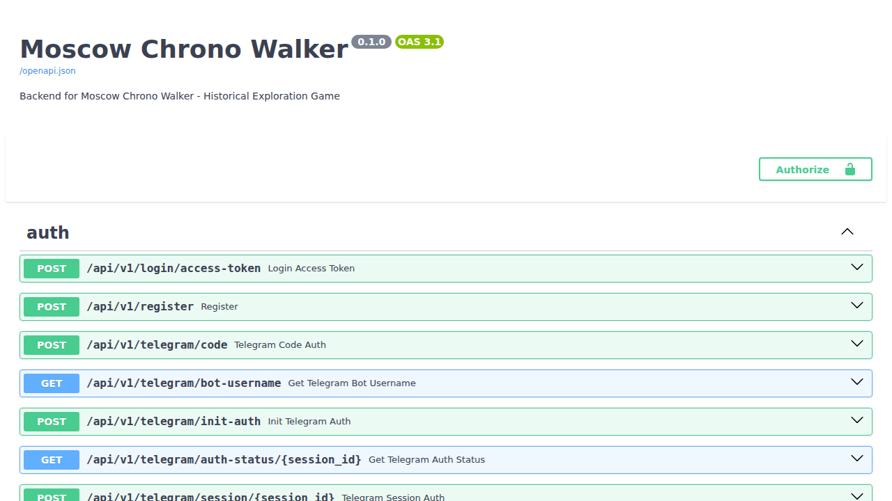
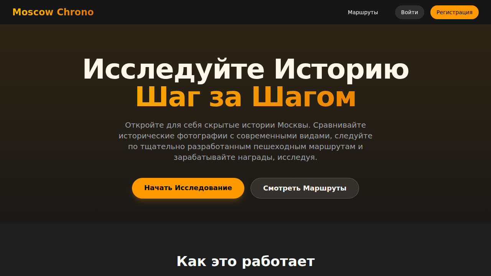
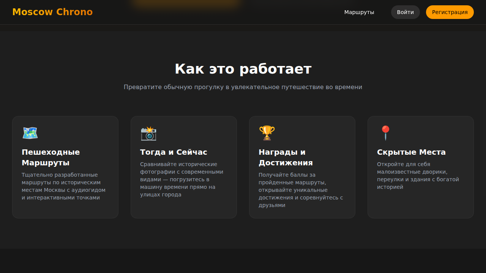
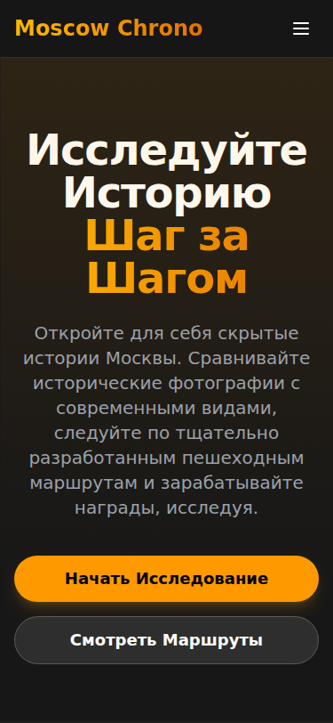
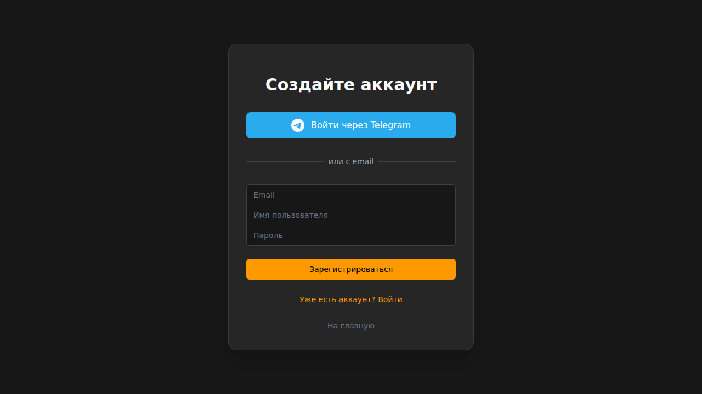

# Разработка прототипа
## Проект: Moscow Chrono — интерактивное PWA-приложение для исторических прогулок по Москве

---

## Содержание
1. [Концепция и постановка задачи](#1-концепция-и-постановка-задачи)
2. [Проектирование архитектуры](#2-проектирование-архитектуры)
3. [Разработка базы данных](#3-разработка-базы-данных)
4. [Реализация Backend API](#4-реализация-backend-api)
5. [Разработка Frontend-приложения](#5-разработка-frontend-приложения)
6. [Интеграция карт и геолокации](#6-интеграция-карт-и-геолокации)
7. [Система геймификации](#7-система-геймификации)
8. [PWA и офлайн-режим](#8-pwa-и-офлайн-режим)
9. [Тестирование и деплой](#9-тестирование-и-деплой)

---

## 1. Концепция и постановка задачи

### 1.1 Идея проекта
Проект родился из наблюдения: молодёжь много времени проводит со смартфонами, но мало гуляет и изучает историю города. Решение — объединить игровые механики с пешеходными маршрутами по историческим местам Москвы.

### 1.2 Ключевые требования
- Кроссплатформенность (iOS, Android, Desktop)
- Работа без интернета (офлайн-режим)
- Геймификация для мотивации пользователей
- Сравнение исторических и современных фотографий
- Интеграция с Telegram для авторизации

### 1.3 Целевая аудитория
- Возраст: 18-35 лет
- Интересы: история, путешествия, игры
- Устройства: преимущественно смартфоны

---

## 2. Проектирование архитектуры

### 2.1 Общая схема системы

```
┌─────────────────────────────────────────────────────────────────┐
│                        КЛИЕНТЫ                                  │
├─────────────────┬─────────────────┬─────────────────────────────┤
│   iOS Safari    │  Android Chrome │      Desktop Browser        │
│      (PWA)      │      (PWA)      │          (PWA)              │
└────────┬────────┴────────┬────────┴──────────────┬──────────────┘
         │                 │                       │
         └─────────────────┼───────────────────────┘
                           │ HTTPS
                           ▼
┌─────────────────────────────────────────────────────────────────┐
│                      FRONTEND (SvelteJS)                        │
│  ┌──────────┐  ┌──────────┐  ┌──────────┐  ┌──────────────┐    │
│  │  Router  │  │   Map    │  │ Galleries│  │Service Worker│    │
│  │(SPA Hash)│  │(Leaflet) │  │(Pannellum│  │  (Workbox)   │    │
│  └──────────┘  └──────────┘  └──────────┘  └──────────────┘    │
└─────────────────────────────┬───────────────────────────────────┘
                              │ REST API
                              ▼
┌─────────────────────────────────────────────────────────────────┐
│                      BACKEND (FastAPI)                          │
│  ┌──────────┐  ┌──────────┐  ┌──────────┐  ┌──────────────┐    │
│  │   Auth   │  │  Routes  │  │ Progress │  │  Gamification│    │
│  │(JWT+TG)  │  │   API    │  │   API    │  │     API      │    │
│  └──────────┘  └──────────┘  └──────────┘  └──────────────┘    │
└─────────────────────────────┬───────────────────────────────────┘
                              │ SQLAlchemy
                              ▼
┌─────────────────────────────────────────────────────────────────┐
│                      DATABASE (PostgreSQL)                      │
│  ┌──────────┐  ┌──────────┐  ┌──────────┐  ┌──────────────┐    │
│  │  Users   │  │  Routes  │  │   POIs   │  │ Achievements │    │
│  └──────────┘  └──────────┘  └──────────┘  └──────────────┘    │
└─────────────────────────────────────────────────────────────────┘
```

### 2.2 Выбор технологий

| Компонент | Технология | Версия | Обоснование |
|-----------|------------|--------|-------------|
| Frontend | SvelteJS | 5.x | Минимальный бандл, реактивность |
| Сборщик | Vite | 7.x | Быстрая сборка, HMR |
| Backend | FastAPI | 0.100+ | Async, автодокументация |
| ORM | SQLAlchemy | 2.x | Async поддержка |
| БД | PostgreSQL | 15+ | ARRAY типы, надёжность |
| Карты | Leaflet.js | 1.9 | Лёгкость, офлайн |
| Панорамы | Photo Sphere Viewer | 5.x | WebGL 360° |
| PWA | Workbox | 7.x | Service Workers |
| Контейнеры | Docker | 24+ | Изоляция, деплой |

---

## 3. Разработка базы данных

### 3.1 ER-диаграмма (основные сущности)

```
┌──────────────────┐       ┌──────────────────┐
│      USER        │       │      ROUTE       │
├──────────────────┤       ├──────────────────┤
│ id (PK)          │       │ id (PK)          │
│ username         │       │ title            │
│ email            │       │ description      │
│ telegram_id      │       │ difficulty       │
│ xp               │       │ reward_xp        │
│ level            │       │ is_premium       │
│ streak_days      │       └────────┬─────────┘
└────────┬─────────┘                │
         │                          │ N:M
         │ 1:N                      │
         ▼                          ▼
┌──────────────────┐       ┌──────────────────┐
│  USER_PROGRESS   │       │    ROUTE_POI     │
├──────────────────┤       ├──────────────────┤
│ id (PK)          │       │ route_id (FK)    │
│ user_id (FK)     │       │ poi_id (FK)      │
│ route_id (FK)    │       │ order            │
│ status           │       └────────┬─────────┘
│ completed_points │                │
└──────────────────┘                │
                                    ▼
┌──────────────────┐       ┌──────────────────┐
│      QUIZ        │◄──────│       POI        │
├──────────────────┤       ├──────────────────┤
│ id (PK)          │       │ id (PK)          │
│ poi_id (FK)      │       │ title            │
│ question         │       │ description      │
│ option_a/b/c/d   │       │ latitude         │
│ correct_answer   │       │ longitude        │
│ xp_reward        │       │ historic_images[]│
└──────────────────┘       │ modern_images[]  │
                           │ panorama_urls    │
                           └──────────────────┘
```

### 3.2 Список таблиц в БД

**Основные (10 таблиц):**
- `user` — профили пользователей
- `route` — маршруты
- `point_of_interest` — точки интереса
- `route_poi` — связь маршрутов и POI
- `user_progress` — прогресс прохождения
- `quiz` — вопросы викторины
- `user_quiz_progress` — ответы на квизы
- `achievement` — достижения
- `user_achievement` — разблокированные достижения
- `friendship` — социальный граф

**Геймификация (8 таблиц):**
- `title` — титулы
- `badge` — бейджи
- `profileframe` — рамки профиля
- `user_title`, `user_badge`, `user_frame` — владение
- `friend_request` — заявки в друзья

### 3.3 Пример модели SQLAlchemy

```python
# backend/app/models/poi.py
from sqlalchemy import Column, Integer, String, Float, Text
from sqlalchemy.dialects.postgresql import ARRAY

class PointOfInterest(Base):
    __tablename__ = "point_of_interest"
    
    id = Column(Integer, primary_key=True)
    title = Column(String, nullable=False)
    description = Column(Text)
    
    # Координаты
    latitude = Column(Float, nullable=False)
    longitude = Column(Float, nullable=False)
    
    # Галереи изображений (PostgreSQL ARRAY)
    historic_images = Column(ARRAY(String), default=[])
    modern_images = Column(ARRAY(String), default=[])
    
    # Панорамы 360°
    historic_panorama_url = Column(String, nullable=True)
    modern_panorama_url = Column(String, nullable=True)
```

---

## 4. Реализация Backend API

### 4.1 Структура проекта

```
backend/
├── app/
│   ├── api/
│   │   └── v1/
│   │       └── endpoints/
│   │           ├── auth.py        # Авторизация
│   │           ├── routes.py      # Маршруты
│   │           ├── progress.py    # Прогресс
│   │           ├── quizzes.py     # Квизы
│   │           ├── achievements.py# Достижения
│   │           ├── friends.py     # Друзья
│   │           └── cosmetics.py   # Косметика
│   ├── models/           # SQLAlchemy модели
│   ├── schemas/          # Pydantic схемы
│   ├── core/
│   │   ├── config.py     # Настройки
│   │   └── security.py   # JWT, хеширование
│   └── main.py           # FastAPI app
├── Dockerfile
└── requirements.txt
```

### 4.2 Скриншот: Swagger документация API



*Рис. 4.1 — Автоматически сгенерированная документация FastAPI (Swagger UI)*

### 4.3 Основные эндпоинты

```
Авторизация:
  POST /api/v1/login/access-token     — Получить JWT токен
  POST /api/v1/register               — Регистрация
  POST /api/v1/telegram/code          — Вход через Telegram

Маршруты:
  GET  /api/v1/routes/                — Список маршрутов
  GET  /api/v1/routes/{id}            — Детали маршрута

Прогресс:
  GET  /api/v1/progress/              — Мой прогресс
  POST /api/v1/progress/              — Начать маршрут
  POST /api/v1/progress/check-in      — Чек-ин в точке

Квизы:
  GET  /api/v1/quizzes/poi/{poi_id}   — Квизы для POI
  POST /api/v1/quizzes/{id}/submit    — Ответить на квиз

Профиль:
  GET  /api/v1/users/me/              — Мой профиль
  GET  /api/v1/achievements/          — Достижения
```

### 4.4 Скриншот: API пользователей и друзей


*Рис. 4.2 — Эндпоинты для работы с пользователями и профилями*

---

## 5. Разработка Frontend-приложения

### 5.1 Структура компонентов Svelte

```
frontend/src/
├── pages/
│   ├── Home.svelte        # Главная с картой
│   ├── Routes.svelte      # Список маршрутов  
│   ├── Profile.svelte     # Профиль пользователя
│   ├── Register.svelte    # Регистрация
│   └── Login.svelte       # Вход
├── components/
│   ├── Map.svelte         # Карта Leaflet
│   ├── PhotoGallery.svelte# Галерея было/стало
│   ├── PanoramaViewer.svelte # 360° панорамы
│   ├── QuizModal.svelte   # Модалка квиза
│   └── OnboardingModal.svelte # Онбординг
├── lib/
│   ├── api.ts             # API клиент
│   └── config.ts          # Конфигурация
└── App.svelte             # Корневой компонент
```

### 5.2 Скриншот: Лендинг (Desktop)



*Рис. 5.1 — Главная страница приложения (desktop версия)*

### 5.3 Скриншот: Функции приложения



*Рис. 5.2 — Блок "Как это работает" с основными функциями*

### 5.4 Скриншот: Мобильная версия



*Рис. 5.3 — Адаптивный дизайн для мобильных устройств (375px)*

### 5.5 Скриншот: Регистрация



*Рис. 5.4 — Форма регистрации с Telegram-авторизацией*

---

## 6. Интеграция карт и геолокации

### 6.1 Компонент карты (Leaflet)

```svelte
<!-- Map.svelte -->
<script lang="ts">
    import L from "leaflet";
    
    // Иконки для разных состояний точек
    const greenIcon = new L.Icon({...});  // Пройдено
    const blueIcon = new L.Icon({...});   // Текущая цель
    const redIcon = new L.Icon({...});    // Будущие
    
    // Отрисовка маршрута
    pois.forEach((poi, index) => {
        let icon;
        if (index < completedCount) icon = greenIcon;
        else if (index === completedCount) icon = blueIcon;
        else return; // Скрыть будущие точки
        
        L.marker([poi.latitude, poi.longitude], { icon })
            .addTo(map)
            .on('click', () => selectPOI(poi));
    });
</script>

<div bind:this={mapElement} class="h-full rounded-xl"></div>
```

### 6.2 Цветовая индикация прогресса

| Цвет | Состояние | Описание |
|------|-----------|----------|
| 🟢 Зелёный | Пройдено | Точка посещена |
| 🔵 Синий | Текущая | Следующая цель |
| 🔴 Красный | Линия пути | Маршрут между точками |

---

## 7. Система геймификации

### 7.1 Формула расчёта уровня

```python
import math

def calculate_level(xp: float) -> int:
    """Формула: L = (-5 + √(49 + 0.16×XP)) / 2"""
    if xp <= 0:
        return 1
    level = (-5 + math.sqrt(49 + 0.16 * xp)) / 2
    return max(1, int(level))
```

### 7.2 Начисление опыта

| Действие | XP | Описание |
|----------|---:|----------|
| Чек-ин в точке | +50 | За каждую посещённую POI |
| Правильный ответ на квиз | +10 | За каждый квиз |
| Завершение маршрута | +100-500 | Бонус зависит от сложности |
| Получение достижения | +25-100 | Бонус за ачивку |

### 7.3 Примеры достижений

```python
achievements = [
    {"code": "first_step", "title": "Первый шаг", 
     "condition": "points >= 1", "xp_reward": 25},
    {"code": "historian", "title": "Историк-любитель",
     "condition": "quizzes >= 10", "xp_reward": 50},
    {"code": "marathoner", "title": "Марафонец",
     "condition": "routes >= 5", "xp_reward": 100},
]
```

---

## 8. PWA и офлайн-режим

### 8.1 Конфигурация Service Worker

```typescript
// vite.config.ts
VitePWA({
  workbox: {
    runtimeCaching: [
      {
        // Тайлы карт — кэш на 30 дней
        urlPattern: /tile\.openstreetmap\.org/,
        handler: 'CacheFirst',
        options: {
          cacheName: 'map-tiles',
          expiration: { maxEntries: 500, maxAgeSeconds: 2592000 }
        }
      },
      {
        // API — сначала сеть, потом кэш
        urlPattern: /\/api\/.*/,
        handler: 'NetworkFirst',
        options: { cacheName: 'api-cache' }
      }
    ]
  }
})
```

### 8.2 Манифест приложения

```json
{
  "name": "Moscow Chrono",
  "short_name": "MoscowChrono",
  "display": "standalone",
  "orientation": "portrait",
  "theme_color": "#171717",
  "background_color": "#171717",
  "start_url": "/"
}
```

---

## 9. Тестирование и деплой

### 9.1 Docker Compose конфигурация

```yaml
version: '3.8'
services:
  db:
    image: postgis/postgis:15-3.3
    environment:
      POSTGRES_DB: moscow_chrono
      POSTGRES_PASSWORD: ${DB_PASSWORD}
    volumes:
      - postgres_data:/var/lib/postgresql/data

  backend:
    build: ./backend
    ports:
      - "8000:8000"
    depends_on:
      - db
    environment:
      DATABASE_URL: postgresql+asyncpg://...

  frontend:
    build: ./frontend
    ports:
      - "5173:5173"
```

### 9.2 Результаты тестирования

| Платформа | Браузер | Статус |
|-----------|---------|--------|
| Android 13 | Chrome | ✅ Работает |
| iOS 17 | Safari | ✅ Работает |
| Windows 11 | Chrome | ✅ Работает |
| macOS 14 | Safari | ✅ Работает |

---

## Итоги разработки

Реализован полнофункциональный прототип PWA-приложения:

- ✅ **Backend**: FastAPI + PostgreSQL (28 таблиц)
- ✅ **Frontend**: SvelteJS + TailwindCSS
- ✅ **Карты**: Leaflet с офлайн-кэшированием
- ✅ **Галереи**: Фото "было/стало" + 360° панорамы
- ✅ **Геймификация**: XP, уровни, достижения, бейджи
- ✅ **Авторизация**: Email + Telegram
- ✅ **PWA**: Service Workers, манифест, офлайн

**Время разработки**: ~3 месяца  
**Строк кода**: ~15,000 (Python + TypeScript + Svelte)
